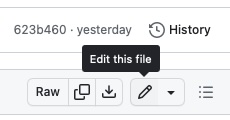
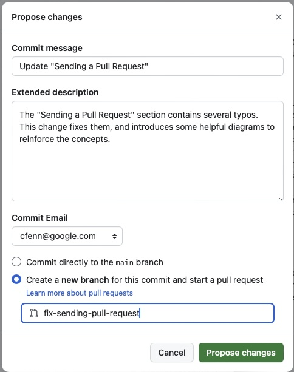
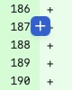
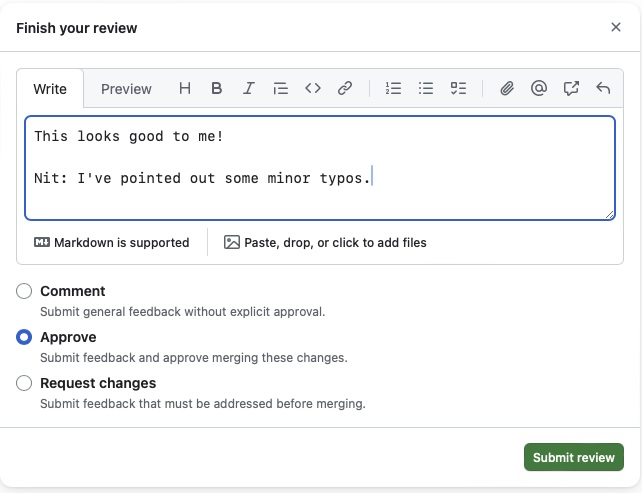
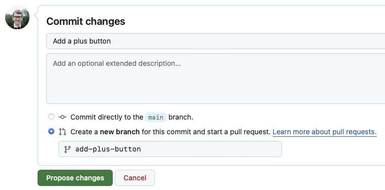
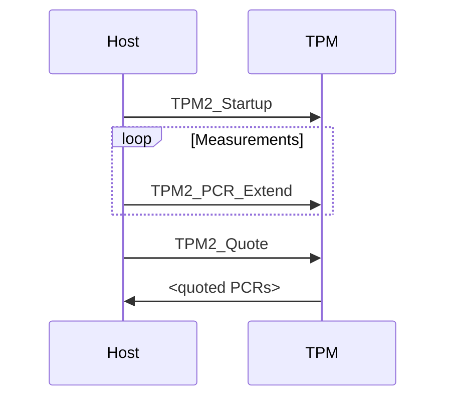

# Disclaimers, Notices, and License Terms

THIS SPECIFICATION IS PROVIDED “AS IS” WITH NO WARRANTIES WHATSOEVER, INCLUDING
ANY WARRANTY OF MERCHANTABILITY, NONINFRINGEMENT, FITNESS FOR ANY PARTICULAR
PURPOSE, OR ANY WARRANTY OTHERWISE ARISING OUT OF ANY PROPOSAL, SPECIFICATION OR
SAMPLE.

Without limitation, TCG disclaims all liability, including liability for
infringement of any proprietary rights, relating to use of information in this
specification and to the implementation of this specification, and TCG disclaims
all liability for cost of procurement of substitute goods or services, lost
profits, loss of use, loss of data or any incidental, consequential, direct,
indirect, or special damages, whether under contract, tort, warranty or
otherwise, arising in any way out of use or reliance upon this specification or
any information herein. This document is copyrighted by Trusted Computing Group
(TCG), and no license, express or implied, is granted herein other than as
follows: You may not copy or reproduce the document or distribute it to others
without written permission from TCG, except that you may freely do so for the
purposes of (a) examining or implementing TCG specifications or (b) developing,
testing, or promoting information technology standards and best practices, so long
as you distribute the document with these disclaimers, notices, and license terms.
Contact the Trusted Computing Group at www.trustedcomputinggroup.org for
information on specification licensing through membership agreements. Any marks
and brands contained herein are the property of their respective owners.

---

# Change History

: {.unnumbered .unlisted}

| **Revision** | **Date**   | **Description** |
| ------------ | ---------- | --------------- |
| 0.1/1        | 2023/12/17 | Initial draft   |

---

# Document Style

**Key Words**

The key words "MUST," "MUST NOT," "REQUIRED," "SHALL," "SHALL NOT," "SHOULD,"
"SHOULD NOT," "RECOMMENDED," "MAY," and "OPTIONAL" in this document's normative
statements are to be interpreted as described in
[RFC 2119: Key words for use in RFCs to Indicate Requirement Levels](https://www.ietf.org/rfc/rfc2119.txt).

**Statement Type**

Please note an important distinction between different sections of text
throughout this document. There are two distinctive kinds of text: _informative
comments_ and _normative statements_. Because most of the text in this
specification will be of the kind _normative statements_, the authors have
informally defined it as the default and, as such, have specifically called out
text of the kind _informative comment_. They have done this by flagging the
beginning and end of each informative comment and highlighting its text in gray.
This means that unless text is specifically marked as of the kind _informative
comment_, it can be considered a _normative statement_.

EXAMPLE:

::: Informative :::
This is the first paragraph of 1–n paragraphs containing text of the kind
informative comment ...

This is the second paragraph of text of the kind informative comment ...

This is the nth paragraph of text of the kind informative comment ...

To understand the TCG specification, the user must read the specification.
(This use of MUST does not require any action).
:::::::::::::::::::

\tableofcontents

\listoftables

\listoffigures

---

# Scope and Purpose

The purpose of this guide is to demonstrate the usage of Markdown-plus-GitHub
document-authorship flows for TCG workgroup usage.

This document contains a boilerplate section at the front called Document Style.
This section is typically included in TCG Specifications and isn't as relevant for Guidance and
Reference documents. It's included here, mainly to demonstrate the usage of Markdown for specifications.

# Getting Started

## Creating a Repository

You can create a repository from scratch, or you can use
[the template repository](https://github.com/TrustedComputingGroup/specification-example)
to get started a little more quickly. There's a little green "Use this template" button in the top right
(see @fig:use-template-button).

{#fig:use-template-button width=50%}

## GitHub Actions {#sec:basic-gh-action}

Even if you used the template repository, please double-check this. As the tools are being actively developed,
there is probably a newer version of the tools available for you!

`.github/workflows/main.yml` might look a bit like this:

```yaml
# Render the spec to PDF on pull requests, and check in the rendered PDF on commits
# to main.

name: Render

on:
  push:
    branches:
      - main
  pull_request:
  workflow_dispatch:

jobs:
  render:
    runs-on: ubuntu-latest
    # This Docker container contains all the Pandoc dependencies for rendering TCG
    # Markdown docs.
    container:
      # IMPORTANT: Check https://github.com/TrustedComputingGroup/pandoc/releases
      # for the latest!
      image: ghcr.io/trustedcomputinggroup/pandoc:0.6.2
    name: Render PDF
    steps:
      - name: Checkout
        uses: actions/checkout@v3

      - name: Render
        # This GitHub action provides an easy way to use the Docker container above
        # with your document.
        # IMPORTANT: Check https://github.com/TrustedComputingGroup/markdown/releases
        # for the latest!
        uses: trustedcomputinggroup/markdown@v0.4.0
        with:
          input-md: main.md
          output-pdf: spec.pdf
          output-docx: spec.docx

      - name: Upload samples
        # This GitHub action uploads samples into the "Checks" tab (for pull requests),
        # so that reviewers can easily see how a proposed change will look in the
        # finished spec.
        uses: actions/upload-artifact@master
        with:
          name: preview
          path: |
            spec.pdf
            spec.docx

      - name: Check in latest render
        # This GitHub action automatically renders and checks-in the PDF produced in
        # the above step. This makes it easier for people to grab the latest rendered
        # version of the document.
        uses: stefanzweifel/git-auto-commit-action@v4
        with:
          commit_message: Generate latest PDF
          file_pattern: spec.pdf
        if: github.event_name != 'pull_request'
```

## Local Testing

These tools have a number of dependencies on LaTeX and LaTeX plugins. The
simplest way to get a consistent build is to use the docker container that gets
used for the GitHub actions.

`docker_run` is provided as a convenience script for Linux systems.

Usage:

```sh
./docker_run --pdf=output.pdf ./input.md
```

You can specify a particular version of the docker container using the
`DOCKER_IMAGE` environment variable:

```sh
DOCKER_IMAGE=ghcr.io/trustedcomputinggroup/pandoc:0.6.5 ./docker_run --pdf=output.pdf ./input.md
```

If you're working on a change to these tools, it can be beneficial to build and
tag a local version of the container and then run it locally:

```sh
docker build --tag working .

DOCKER_IMAGE=working:latest ./docker_run --pdf=output.pdf ./input.md
```

## TCG Document Boilerplate

There are several sections that are recommended for use in every TCG Markdown document.

The trickiest section is the YAML front matter at the very top of the Markdown file.
It looks like this:

```md
--- 
title: "TCG Markdown User's Guide"
version: 0.1
revision: 1
date: 12/17/2023
type: GUIDANCE
status: Draft
...
```

This section provides metadata to the tools.

### Front Matter Variables

#### title

REQUIRED.

`title` is the title of the document.

#### version

REQUIRED unless you're using [`--gitversion`](#git-version-parsing)

`version` is the version of the document.

#### revision

OPTIONAL.

`revision` is the revision of the document. If not provided, the revision is not printed.

#### date

REQUIRED unless you're using [`--gitversion`](#git-version-parsing).

`date` is the full date of the document, in YYYY/MM/DD form.

#### type

REQUIRED.

`type` should be one of: "SPECIFICATION", "GUIDANCE", or "REFERENCE". It appears on the title page on the left-hand side.

#### status

REQUIRED unless you're using [`--gitstatus`](#git-status-parsing).

`status` should be one of: "Draft", "Review", or "Published".

If it is not "Published", then a gray watermark "DRAFT" will appear on all pages after the title page.

#### template

OPTIONAL.

`template` should be one of: `greentop`, `bluetop`. It customizes the title page style. If not provided, `greentop` is the current default.

Typically, specifications use the `greentop` template, and guidance or reference documents use the `bluetop` template.

### Backslash Macros

Understanding of LaTeX is not required in order to use TCG Markdown tools. However, a few special macros can be used from Markdown to fully specify a TCG document.

#### Table of Contents {#sec:toc}

After the boilerplate sections, most TCG documents should set up the tables of contents, and lists of tables and figures.

```
\tableofcontents

\listoftables

\listoffigures
```

Almost every document should have a table of contents. Some documents may not need lists of tables or figures.

#### Appendices

At the end of the last "regular" section of the document, use

```
\beginappendices
```

to mark the transition to the "Appendix" portion of the document. Only documents that have appendices
are expected to use this macro.

# Collaboration Model

Users familiar with Git and who prefer to use their own tools may choose to skip this section.

```mermaid {caption="GitHub Collaboration Workflow" #fig:collaboration-workflow}
    gitGraph
       commit id: "head"
       branch proposed-edits-1
       commit id: "propose-1"
       commit id: "respond-to-feedback-1"
       commit id: "respond-to-feedback-2"
       checkout main
       merge proposed-edits-1
       branch proposed-edits-2
       commit id: "propose-2"
       commit id: "respond-to-feedback-3"
       commit id: "respond-to-feedback-4"
       checkout main
       merge proposed-edits-2
```

As visualized in @fig:collaboration-workflow, proposed changes to a GitHub Markdown repository take the form of
"Pull Requests" (PRs). A *proposer* of a change proposes a PR that changes some files in the repository.
This PR contains an initial *commit*, which is a unit of change to files.
*Reviewers* can provide comments and suggestions on the proposed edits. The *proposer* can respond to
the feedback by adding additional *commits* into their PR. When all parties are satisfied, the PR is
*approved* and *merged* into the main repository.

## Sending a Pull Request {#sec:sending-a-pr}

When you navigate to a GitHub repository containing Markdown, you can view the Markdown files by
clicking on them.

From this view, there is an "Edit" (pencil) button in the upper right-hand corner, pictured in
@fig:edit-file-button:

{#fig:edit-file-button width=30%}

This will take you to a view where you can edit the file. There is a "Preview" button that you can use
to see roughly how the changes will look when viewed from GitHub. Most everyday changes to TCG docs
can be previewed in high enough fidelity with this tool.

When you're satisfied with your changes, use the green "Commit changes..." button. This will bring up
the dialog box pictured in @fig:propose-changes:

{#fig:propose-changes width=60%}

Include a descriptive commit message, extended description, and new branch name for your change,
then click the green "Propose changes" button.

You're almost done! This will take you to a page called "Open a pull request". You can provide some
additional context to reviewers about why you want to make this change. When you're satisfied, click
"Create pull request."

## Reviewing a Pull Request

After a PR has been sent by someone else, you can review the changes with the "Add your review" button
in the upper right-hand corner of the change description page.

This button takes you to a review flow, where you can provide comments on individual lines of the changes.
You can leave a comment on an individual line by mousing over the line and clicking the blue "+" button,
which looks like @fig:plus-button:

{#fig:plus-button}

After you've gone through all the changed files and provided your comments, you can click "Review changes"
to finish the review. This dialog looks like @fig:finish-review:

{#fig:finish-review width=60%}

Here, you can provide summary comments and mark your review as one of:

* Comment (Just providing feedback)
* Approve (Approving the changes)
* Request changes (Explicitly not approving the changes, with specific actionable feedback)

# Using Markdown

Markdown is intended to be a lightweight language for authoring documents. Most of the time, it looks
exactly the same as plain text.

## Basic Formatting

The structure of the document is guided by lines that begin with `#`:

```md
# Section Titles

## Subsection Titles

### Sub-subsection Titles
```

and so on.

When you put `*asterisks*` around a word, it renders as *italics*.

When you put `**double asterisks**` around a word, it renders as **boldface**.

When you put ``` `backticks` ``` around a word, it renders as `monospace`.

To force a new page, use `---`. This will appear as a horizontal line in GitHub and a page break in the PDF.

---

When you need to write math, use `$ dollar signs $` for inline math notation, or `$$ double dollar signs $$` for equations. This is explained in more detail in @sec:math.

Numbered and bulleted lists begin with numbers and asterisks:

```md
* Something
* Something else

1. First thing
2. Second thing
```

Becomes:

* Something
* Something else

1. First thing
2. Second thing

Hyperlink syntax for the [TCG Website](https://trustedcomputinggroup.org) looks like: `[TCG Website](https://trustedcomputinggroup.org)`.

Hyperlink syntax for the [Using Markdown](#using-markdown) section looks like:
`[Using Markdown](#using-markdown)`. If you provided a stable cross-referencing link like this
document for [Cross-References](#sec:cross-references), you can use it like:
`[Cross-References](#sec:cross-references)`.

You can use triple backticks like so to create blocks of code:

````md
```
int i = 42;
```
````

The result looks like this:

```
int i = 42;
```

You can tell Markdown what language the code is in, to get syntax highlighting:

````md
```c
// Awesome!
int i = 42;
```
````

The result looks like this:

```c
// Awesome!
int i = 42;
```

## Cross-References {#sec:cross-references}

In general, sections, tables, figures, and equations can be referenced using the `@` symbol. These cross-references do not show up in the GitHub markdown, but will appear in the final document.

### Sections

When you add `{#sec:section-reference}` at the end of a section title, as in:

```md
## Cross-References {#sec:cross-references}
```

it creates a cross-reference
that you can use with `@sec:section-reference`. For example, `@sec:cross-references` @sec:cross-references.

### Tables

See @sec:tables for more information about cross-references to tables.

### Figures

See @sec:figures for more information about cross-references to figures.

### Equations

See @sec:math for more information about cross-references to equations.

## TCG-Specific Blocks

### Informative Text Blocks

TCG uses a special visual style to demarcate informative non-binding remarks within specifications.

To create an informative note, use the following syntax:

```md
> This is the only informative text block in this document.
>
> These blocks can contain multiple paragraphs, tied together by lines containing just
> ">".
>
> These blocks can even contain tables! However, be wary of providing tables that are
> too large in an Informative Text block.
>
> | **Document Type** | **Informative Blocks** |
> | ----------------- | ---------------------- |
> | SPECIFICATION     | Usually                |
> | GUIDANCE          | Rarely                 |
> | REFERENCE         | Rarely                 |
```

The above Markdown code becomes:

<!---
N.B., because this guide renders with '--plain_quotes', this particular
informative block actually uses the ::: syntax.
-->

::: Informative :::
This is the only informative text block in this document.

These blocks can contain multiple paragraphs, tied together by lines containing just
">".

These blocks can even contain tables! However, be wary of providing tables that are
too large in an Informative Text block.

| **Document Type** | **Informative Blocks** |
| ----------------- | ---------------------- |
| SPECIFICATION     | Usually                |
| GUIDANCE          | Rarely                 |
| REFERENCE         | Rarely                 |
:::::::::::::::::::

#### Alternative Syntax for Informative Text {#sec:informative-text-alt-syntax}

```md
::: Informative :::
Pandoc calls this a
["fenced div"](https://pandoc.org/chunkedhtml-demo/8.18-divs-and-spans.html).
:::::::::::::::::::
```

::: Informative :::
Pandoc calls this a
["fenced div"](https://pandoc.org/chunkedhtml-demo/8.18-divs-and-spans.html).
:::::::::::::::::::

In addition to "Informative", the following other types of notes are supported:

### Other Informative Blocks

::: Warning :::
These types of blocks are supported by the toolset, but not yet approved by TCG
Marketing WG.
:::::::::::::::

Writers of a document may prefer more compact "informative" blocks with more
obvious semantics, like the warning above. In this case, the text ist still
contained within a "TCG Informative" gray box, but with a more meaningful
header and no footer.

* Note
* Example
* Caveat
* Tip
* Warning

::: Note :::
This is a "Note" block.
::::::::::::

::: Example :::
This is an "Example" block.
:::::::::::::::

::: Caveat :::
This is a "Caveat" block.
::::::::::::::

::: Tip :::
This is a "Tip" block.
:::::::::::

::: Warning :::
This is a "Warning" block.
:::::::::::::::

The behavior of blocks with labels not specified above may change meaningfully in future versions of this toolkit, so use them at your own risk.

# Figures {#sec:figures}

There are two ways to include a figure in a document: as an image file checked into the repository, and as a [Mermaid](http://mermaid.js.org) diagram.

## Images

Upload plain image files into the repository with the "Add file" button.

For compatibility reasons, all image files should be in the root of the repository (main directory). In the future, better support for organizing figures may be added to these tools.

See @sec:sending-a-pr for the flow that needs to be followed for getting your image uploads reviewed. You can add more changes
to the branch for the PR that reference the image, or you can do it in a subsequent PR.

Markdown syntax for including an image looks like ``. For example:

```md
{#fig:add-plus-button width=60%}
```

becomes:

{#fig:add-plus-button width=60%}

The `{#fig:add-plus-button}` attribute (note there are no spaces between the `)` and the `{`!) does two things:

1. Includes the figure in the List of Figures (if you used `\listoffigures` as described in @sec:toc).
2. Numbers the figure so you can reference it as @fig:add-plus-button by just typing `@fig:add-plus-button`.

Including `width=60%` here specifies that the image should take up 60% of the page's width.

## Mermaid Charts

[Mermaid](http://mermaid.js.org) is a language for text-based diagrams for inclusion in Markdown documents.
See the Mermaid website for a more exhaustive list of types of diagrams.

### Sequence Diagrams

Mermaid supports swim-lane digrams like @fig:startup with the following notation:

````md

````


Crossreferences to Mermaid diagrams are supported by providing both `caption`
and `#fig:xxxxx` classes in curly braces.

### Flow Charts

Mermaid supports flow-charts like @fig:flowchart with the following notation:

````md

````


# Tables {#sec:tables}

We support several notation styles for tables.

## Markdown Tables

There are several ways to write a table in Markdown.

### Simple Markdown Tables {#sec:simple-markdown-tables}

Small, simple tables like @tbl:shapes are easier to read in raw Markdown form in the following style:

```md
Table: Shapes {#tbl:shapes}

| **Shape**    | **Number of sides** |
| ------------ | ------------------- |
| Square       | 4                   |
| Triangle     | 3                   |
| Möbius strip | 1                   |
```

Table: Shapes {#tbl:shapes}

| **Shape**    | **Number of sides** |
| ------------ | ------------------- |
| Square       | 4                   |
| Triangle     | 3                   |
| Möbius strip | 1                   |

Note the table caption and cross-reference in curly braces above the table.

### Multiline Markdown Tables {#sec:multiline-markdown-tables}

Sometimes, you may need to write a lot of Markdown content in the cell of a table,
and this content may need multiple lines in your editor.

```md
Table: Table Types {#tbl:table-types}

-------------------------------------------------------------------------------
**Table Kind**  **Easy?**   **Recommended?**    **References**
--------------- ----------- ------------------- -------------------------------
Simple          Yes         When each cell      @sec:simple-markdown-tables,
Markdown                    is about one        @tbl:shapes
Tables                      word or so.

Multiline       Yes         When you have       @sec:multiline-markdown-tables,
Markdown                    content that's      @tbl:table-types
Tables                      more than a few
                            words.

Grid Markdown   No          When you have       @sec:grid-tables,
Tables                      row or column       @tbl:fruits-grid
                            spans and need
                            full Markdown
                            support (e.g.,
                            crossrefs or
                            equations).

HTML            Yes         When you have       @sec:html-tables,
Tables                      row or column       @tbl:fruits-html
                            spans, and
                            don't need
                            full Markdown
                            or don't mind
                            doing all the
                            styling in
                            HTML.
-------------------------------------------------------------------------------
```

Table: Table Types {#tbl:table-types}

-------------------------------------------------------------------------------
**Table Kind**  **Easy?**   **Recommended?**    **References**
--------------- ----------- ------------------- -------------------------------
Simple          Yes         When each cell      @sec:simple-markdown-tables,
Markdown                    is about one        @tbl:shapes
Tables                      word or so.

Multiline       Yes         When you have       @sec:multiline-markdown-tables,
Markdown                    content that's      @tbl:table-types
Tables                      more than a few
                            words.

Grid Markdown   No          When you have       @sec:grid-tables,
Tables                      row or column       @tbl:fruits-grid
                            spans and need
                            full Markdown
                            support (e.g.,
                            crossrefs or
                            equations).

HTML            Yes         When you have       @sec:html-tables,
Tables                      row or column       @tbl:fruits-html
                            spans, and
                            don't need
                            full Markdown
                            or don't mind
                            doing all the
                            styling in
                            HTML.
-------------------------------------------------------------------------------

### Grid Tables {#sec:grid-tables}

You may have some data that needs to be presented in a table that allows you
to make cells span rows or columns. Grid tables like @tbl:fruits-grid can be
used for this. Note that editing these tables requires a bit more typing. It's
recommended to use these only when you need row and column spanning.

Some tools provide assistance for generating tables of this type. If you find
a tool that is handy for editing Markdown grid-style tables, please send a PR
to github.com/trustedcomputinggroup/pandoc!

```md
Table: Fruits (Grid) {#tbl:fruits-grid}

+----------------------+----------------------------+
| **Color and Fruit**  | **Mistaken for Vegetable** |
+=============+========+============================+
|             | Red    | No                         |
| Apple       +--------+----------------------------+
|             | Green  | No                         |
+-------------+--------+----------------------------+
| Tomato      | Red    | Yes                        |
+-------------+--------+----------------------------+
| Banana      | Yellow | No                         |
+-------------+--------+----------------------------+
```

Table: Fruits (Grid) {#tbl:fruits-grid}

+----------------------+----------------------------+
| **Color and Fruit**  | **Mistaken for Vegetable** |
+=============+========+============================+
|             | Red    | No                         |
| Apple       +--------+----------------------------+
|             | Green  | No                         |
+-------------+--------+----------------------------+
| Tomato      | Red    | Yes                        |
+-------------+--------+----------------------------+
| Banana      | Yellow | No                         |
+-------------+--------+----------------------------+


## HTML Tables {#sec:html-tables}

A rowspan/colspan table like @tbl:fruits-grid can be implemented in HTML like
the below. Note that this is a little easier to type, and a little harder to
read in plain-text form. We recommend preferring [grid tables](#sec:grid-tables)
to HTML tables, but HTML tables can be fine in certain situations (for example,
a gradual migration away from a Word document using Pandoc, which typically
converts Word tables into HTML).

```md
<table id="tbl:fruits-html">
    <caption>Fruits (HTML)</caption>
    <colgroup>
        <col style="width: 12%" />
        <col style="width: 13%" />
        <col style="width: 45%" />
    </colgroup>
    <tr>
        <th colspan="2"><strong>Color and Fruit</strong></th>
        <th><strong>Mistaken for Vegetable</strong></th>
    </tr>
    <tr>
        <td rowspan="2">Apple</td>
        <td>Red</td>
        <td>No</td>
    </tr>
    <tr>
        <td>Green</td>
        <td>No</td>
    </tr>
    <tr>
        <td>Tomato</td>
        <td>Red</td>
        <td>Yes</td>
    </tr>
    <tr>
        <td>Banana</td>
        <td>Yellow</td>
        <td>No</td>
    </tr>
</table>
```

The above HTML table becomes the below:

<table id="tbl:fruits-html">
    <caption>Fruits (HTML)</caption>
    <colgroup>
        <col style="width: 12%" />
        <col style="width: 13%" />
        <col style="width: 45%" />
    </colgroup>
    <tr>
        <th colspan="2"><strong>Color and Fruit</strong></th>
        <th><strong>Mistaken for Vegetable</strong></th>
    </tr>
    <tr>
        <td rowspan="2">Apple</td>
        <td>Red</td>
        <td>No</td>
    </tr>
    <tr>
        <td>Green</td>
        <td>No</td>
    </tr>
    <tr>
        <td>Tomato</td>
        <td>Red</td>
        <td>Yes</td>
    </tr>
    <tr>
        <td>Banana</td>
        <td>Yellow</td>
        <td>No</td>
    </tr>
</table>

Note the table caption in the `<caption>` element, and the table cross-reference in the `id` attribute of the `<table>` element.

::: Caveat :::
If you must use HTML tables, always use `<colgroup>` to style the width of the columns.
If you don't, the table may run off the side of the page.
::::::::::::::

# Math {#sec:math}

## Equations

Markdown supports inline math notation. For example, @eq:fermat can be typeset as:

```md
$$ \nexists {n \ge 3; a, b, c \in \mathbb{Z}} \mid a^n + b^n = c^n $$ {#eq:fermat}
```

Note the `{#eq:fermat}` at the end of the equation. This allows referencing @eq:fermat with `@eq:fermat`.

$$ \nexists {n \ge 3; a, b, c \in \mathbb{Z}} \mid a^n + b^n = c^n $$ {#eq:fermat}

## Inline math

Sometimes, you just need a little inline math in the middle of a sentence, like with `$a^2 + b^2 = c^2$` to get $a^2 + b^2 = c^2$.

## Words in equations

To typeset complex equations with multi-character identifiers (such as the function "HMAC" or the word "OPAD") in @eq:hmac-iso,
we recommend using the functions `\mathbf` (for functions) and `\mathit` (for identifiers).
This avoids strange kerning issues where a string is treated as a product of single-character symbols, like in @eq:hmac-iso-bad-kerning:

```md
$$ \mathbf{HMAC}(K, \mathit{someTEXT}) \coloneq H((\bar{K} \oplus \mathit{OPAD}) \Vert H((\bar{K} \oplus \mathit{IPAD}) \Vert \mathit{someTEXT})) $$ {#eq:hmac-iso}
```

$$ \mathbf{HMAC}(K, \mathit{someTEXT}) \coloneq H((\bar{K} \oplus \mathit{OPAD}) \Vert H((\bar{K} \oplus \mathit{IPAD}) \Vert \mathit{someTEXT})) $$ {#eq:hmac-iso}

```md
$$ HMAC(K, someTEXT) \coloneq H((\bar{K} \oplus OPAD) \Vert H((\bar{K} \oplus IPAD) \Vert someTEXT)) $$ {#eq:hmac-iso-bad-kerning}
```

$$ HMAC(K, someTEXT) \coloneq H((\bar{K} \oplus OPAD) \Vert H((\bar{K} \oplus IPAD) \Vert someTEXT)) $$ {#eq:hmac-iso-bad-kerning}

# Advanced Features

In the GitHub action YAML, you can enable some advanced features.

## Git Version Parsing

Use `extra-build-options: "--gitversion"` to let Git number the document for you.

```yaml
      - name: Run the action
        uses: trustedcomputinggroup/markdown@latest
        with:
          extra-build-options: "--gitversion"
```

When you do this, the tool will check for a recent [release](https://docs.github.com/en/repositories/releasing-projects-on-github/managing-releases-in-a-repository) in the repository. It will use the major.minor
version number from the tag as the document version, and the number of commits since that tag as the revision.
This way, you don't have to manually update the version or revision numbers in your document!

### Conventions for Release Naming

The tooling expects the following conventions for tagging your releases:

* `vX.Y` indicates a regular draft of version X.Y.
* `rX.Y` indicates a review draft of version X.Y.
* `pX.Y` indicates a published version.

## Git Status Parsing

Use `extra-build-options: "--gitstatus"` to let Git number AND set the status of the document for you.

```yaml
      - name: Run the action
        uses: trustedcomputinggroup/markdown@latest
        with:
          extra-build-options: "--gitstatus"
```

See [Conventions](#conventions-for-release-naming). When `--gitstatus` is enabled, the leading character
(which is expected to be one of: `v`, `r`, or `p`) is used to determine the document's status at
revision 0. Commits on top of any type of version are always considered to be drafts.

## Running Pandoc with Releases

@sec:basic-gh-action shows an example of a GitHub action that automatically runs Pandoc on every
pull request and push to the repository.

You may wish to run the workflow on releases, and attach the results to the release page, for
example to have it generate a docx file to send to the Technical Committee for review, or when
publishing a final version of a document.

Use the example below as a guide for how you can have Pandoc automatically render the doc
(maybe basing its [status](#git-status-parsing) on the released tag).

```yaml
# Render the spec to PDF and Word on releases.

name: Render (PDF and Word)

on:
  release:
    types: [released]

jobs:
  render-spec-pdf:
    runs-on: ubuntu-latest
    container:
      image: ghcr.io/trustedcomputinggroup/pandoc:0.7.1
    name: Render (pdf)
    steps:
      - name: Checkout
        uses: actions/checkout@v3

      - name: Render
        uses: trustedcomputinggroup/markdown@v0.4.2
        with:
          input-md: spec.md
          extra-build-options: "--gitstatus"
          output-pdf: spec.pdf

      - name: Upload to release
        uses: svenstaro/upload-release-action@v2
        with:
          repo_token: ${{ secrets.GITHUB_TOKEN }}
          file: spec.pdf
          tag: ${{ github.ref }}
          overwrite: true
          body: "Part 1 (PDF)"

  render-spec-docx:
    runs-on: ubuntu-latest
    container:
      image: ghcr.io/trustedcomputinggroup/pandoc:0.6.8
    name: Render Part 1 (docx)
    steps:
      - name: Checkout
        uses: actions/checkout@v3

      - name: Render
        uses: trustedcomputinggroup/markdown@v0.4.2
        with:
          input-md: spec.md
          extra-build-options: "--gitstatus"
          output-docx: spec.docx

      - name: Upload to release
        uses: svenstaro/upload-release-action@v2
        with:
          repo_token: ${{ secrets.GITHUB_TOKEN }}
          file: spec.docx
          tag: ${{ github.ref }}
          overwrite: true
          body: "Part 1 (Word)"
```

## Regular Quote Support

Use `extra-build-options: "--plain_quotes"` to disable the automatic conversion
of block-quotes into TCG Informative Text blocks (see
@sec:informative-text-alt-syntax). If you use this feature, block-quotes will
look like the below:

> I'm a block quote!
>
> Look at me!

Instead of like the below:

::: Informative :::
I'm a block quote!

Look at me!
:::::::::::::::::::

## Landscape Tables

Sometimes, you may prefer for a table to be presented in landscape orientation.
You can do this using the `.landscape` class, like in @tbl:wide:

```md
Table: Wide Table {#tbl:wide .landscape}

---------------------------------------------------------------------------
Lorem           Ipsum           Dolor            Sit          Amet
--------------- --------------- ---------------- ------------ -------------
consectetur     adipiscing      elit             sed          do

eiusmod         tempor          incididunt       ut           labore

et              dolore          magna            aliqua.      Ut

enim            ad              minim            veniam,      quis

nostrud         exercitation    ullamco          laboris      nisi

ut              aliquip         ex               ea           commodo

consequat.      Duis            aute             irure        dolor

in              reprehenderit   in               voluptate    velit

esse            cillum          dolore           eu           fugiat

nulla           pariatur.       Excepteur        sint         occaecat

cupidatat       non             proident,        sunt         in

culpa           qui             officia          deserunt     mollit

anim            id              est              laborum.
---------------------------------------------------------------------------
```

This also works for HTML tables, by using the `class` attribute:

```md
<table id="tbl:wide-html" class="landscape">
...
```

Table: Wide Table {#tbl:wide .landscape}

---------------------------------------------------------------------------
Lorem           Ipsum           Dolor            Sit          Amet
--------------- --------------- ---------------- ------------ -------------
consectetur     adipiscing      elit             sed          do

eiusmod         tempor          incididunt       ut           labore

et              dolore          magna            aliqua.      Ut

enim            ad              minim            veniam,      quis

nostrud         exercitation    ullamco          laboris      nisi

ut              aliquip         ex               ea           commodo

consequat.      Duis            aute             irure        dolor

in              reprehenderit   in               voluptate    velit

esse            cillum          dolore           eu           fugiat

nulla           pariatur.       Excepteur        sint         occaecat

cupidatat       non             proident,        sunt         in

culpa           qui             officia          deserunt     mollit

anim            id              est              laborum.
---------------------------------------------------------------------------

## Landscape Figures

Figures can be placed on landscape pages as in @fig:_landscape_swimlane by including the string `_landscape_` in the ID:

````md
```mermaid {caption="Complicated Swimlane" #fig:_landscape_swimlane width=3000}
sequenceDiagram
Alice->>Bob: Hello
Bob->>Carl: Hello
Carl->>Debbie: Hello
Debbie->>Eve: Hello
Eve->>Frank: Hello
Frank->>Gertrude: Hello
Gertrude->>Frank: Goodbye
Frank->>Eve: Goodbye
Eve->>Debbie: Goodbye
Debbie->>Carl: Goodbye
Carl->>Bob: Goodbye
Bob->>Alice: Goodbye
```
````

```mermaid {caption="Complicated Swimlane" #fig:_landscape_swimlane width=3000}
sequenceDiagram
Alice->>Bob: Hello
Bob->>Carl: Hello
Carl->>Debbie: Hello
Debbie->>Eve: Hello
Eve->>Frank: Hello
Frank->>Gertrude: Hello
Gertrude->>Frank: Goodbye
Frank->>Eve: Goodbye
Eve->>Debbie: Goodbye
Debbie->>Carl: Goodbye
Carl->>Bob: Goodbye
Bob->>Alice: Goodbye
```

\beginappendices

# Reporting Issues with the Tools

Please report issues with the tooling at [https://github.com/TrustedComputingGroup/pandoc/issues](https://github.com/TrustedComputingGroup/pandoc/issues).
