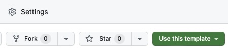

# Disclaimers, Notices, and License Terms

THIS SPECIFICATION IS PROVIDED “AS IS” WITH NO WARRANTIES WHATSOEVER, INCLUDING
ANY WARRANTY OF MERCHANTABILITY, NONINFRINGEMENT, FITNESS FOR ANY PARTICULAR
PURPOSE, OR ANY WARRANTY OTHERWISE ARISING OUT OF ANY PROPOSAL, SPECIFICATION OR
SAMPLE.

Without limitation, TCG disclaims all liability, including liability for
infringement of any proprietary rights, relating to use of information in this
specification and to the implementation of this specification, and TCG disclaims
all liability for cost of procurement of substitute goods or services, lost
profits, loss of use, loss of data or any incidental, consequential, direct,
indirect, or special damages, whether under contract, tort, warranty or
otherwise, arising in any way out of use or reliance upon this specification or
any information herein. This document is copyrighted by Trusted Computing Group
(TCG), and no license, express or implied, is granted herein other than as
follows: You may not copy or reproduce the document or distribute it to others
without written permission from TCG, except that you may freely do so for the
purposes of (a) examining or implementing TCG specifications or (b) developing,
testing, or promoting information technology standards and best practices, so long
as you distribute the document with these disclaimers, notices, and license terms.
Contact the Trusted Computing Group at www.trustedcomputinggroup.org for
information on specification licensing through membership agreements. Any marks
and brands contained herein are the property of their respective owners.

---

# Change History

| Revision     | Date       | Description     |
| ------------ | ---------- | --------------- |
| 0.1/1        | 2023/12/17 | Initial draft   |

---

# Document Style

**Key Words**

The key words "MUST," "MUST NOT," "REQUIRED," "SHALL," "SHALL NOT," "SHOULD,"
"SHOULD NOT," "RECOMMENDED," "MAY," and "OPTIONAL" in this document's normative
statements are to be interpreted as described in
[RFC 2119: Key words for use in RFCs to Indicate Requirement Levels](https://www.ietf.org/rfc/rfc2119.txt).

**Statement Type**

Please note an important distinction between different sections of text
throughout this document. There are two distinctive kinds of text: _informative
comments_ and _normative statements_. Because most of the text in this
specification will be of the kind _normative statements_, the authors have
informally defined it as the default and, as such, have specifically called out
text of the kind _informative comment_. They have done this by flagging the
beginning and end of each informative comment and highlighting its text in gray.
This means that unless text is specifically marked as of the kind _informative
comment_, it can be considered a _normative statement_.

EXAMPLE:

::: Informative :::
Reach out to <admin@trustedcomputinggroup> with any questions about this document.
:::::::::::::::::::

\tableofcontents

\listoftables

\listoffigures

---

# Scope and Purpose

The purpose of this guide is to demonstrate the usage of Markdown-plus-GitHub
document-authorship flows for TCG workgroup usage.

This document contains a boilerplate section at the front called Document Style.
This section is typically included in TCG Specifications and isn't as relevant for Guidance and
Reference documents. It's included here, mainly to demonstrate the usage of Markdown for specifications.

# Getting Started

## Creating a Repository

You can create a repository from scratch, or you can use
[the template repository](https://github.com/TrustedComputingGroup/specification-example)
to get started a little more quickly. There's a little green "Use this template" button in the top right
(see @fig:use-template-button).

{#fig:use-template-button width=50%}

## GitHub Actions {#sec:basic-gh-action}

Even if you used the template repository, please double-check this. As the tools
are being actively developed, there is probably a newer version of the tools
available for you!

:::::::::::::::::::::::::::::::::::: Note :::::::::::::::::::::::::::::::::::::
Use `ghcr.io/trustedcomputinggroup/pandoc:latest` at your own risk. As the tools
may change defaults from version to version, it is better to pin your doc to
a particular version of the tools and periodically update the tools as needed.
:::::::::::::::::::::::::::::::::::::::::::::::::::::::::::::::::::::::::::::::

A typical GitHub Markdown repo will:

* Render the spec to PDF on pull requests and attach the PDF to the PR.
* Render the spec to PDF and Word on releases and attach them to the release.
* Cache the LaTex intermediate files to the GitHub actions cache. This allows
  small changes to the doc to render faster.

`.github/workflows/actions.yml` might look a bit like this:

```yaml
name: Render spec
on:
  pull_request:
  release:
    types: [published]

jobs:
  render:
    runs-on: ubuntu-latest
    container:
      image: ghcr.io/trustedcomputinggroup/pandoc:0.9.10
    name: Render PDF and Word
    steps:
      - name: Checkout
        uses: actions/checkout@v3
        with:
          fetch-depth: 0
          fetch-tags: true

      - name: Cache LaTeX files
        uses: actions/cache@v3
        env:
          cache-name: cache-latex-files
        with:
          path: |
            *.aux
            *.fdb_latexmk
            *.lof
            *.lot
            *.toc
          key: latex-${{ github.run_id }}
          restore-keys: latex

      - name: Render
        uses: trustedcomputinggroup/markdown@v0.4.2
        with:
          input-md: spec.md
          output-pdf: spec.pdf
          output-docx: spec.docx

      - name: Upload PDF to PR
        uses: actions/upload-artifact@master
        if: ${{ github.event_name == 'pull_request' }}
        with:
          name: spec.pdf
          path: spec.pdf

      - name: Upload PDF and docx to release
        uses: svenstaro/upload-release-action@v2
        if: ${{ github.event_name == 'release' }}
        with:
          repo_token: ${{ secrets.GITHUB_TOKEN }}
          file: spec.*
          tag: ${{ github.ref }}
          overwrite: true
          file_glob: true
```

## Local Testing

These tools have a number of dependencies on LaTeX and LaTeX plugins. The
simplest way to get a consistent build is to use the docker container that gets
used for the GitHub actions.

`docker_run` is provided as a convenience script for Linux systems.

Usage:

```sh
./docker_run --pdf=output.pdf ./input.md
```

You can specify a particular version of the docker container using the
`DOCKER_IMAGE` environment variable:

```sh
DOCKER_IMAGE=ghcr.io/trustedcomputinggroup/pandoc:0.6.5 ./docker_run --pdf=output.pdf ./input.md
```

If you're working on a change to these tools, it can be beneficial to build and
tag a local version of the container and then run it locally:

```sh
docker build --tag working .

DOCKER_IMAGE=working:latest ./docker_run --pdf=output.pdf ./input.md
```

## TCG Document Boilerplate

There are several sections that are recommended for use in every TCG Markdown document.

The trickiest section is the YAML front matter at the very top of the Markdown file.
It looks like this:

```md
--- 
title: "TCG Markdown User's Guide"
type: GUIDANCE
...
```

This section provides metadata to the tools.

### Front Matter Variables {#sec:yaml-frontmatter}

#### title

REQUIRED.

`title` is the title of the document.

#### type

REQUIRED.

`type` should be one of: "SPECIFICATION", "GUIDANCE", or "REFERENCE". It appears on the title page on the left-hand side.

### Backslash Macros

Understanding of LaTeX is not required in order to use TCG Markdown tools. However, a few special macros can be used from Markdown to fully specify a TCG document.

#### Table of Contents {#sec:toc}

After the boilerplate sections, most TCG documents should set up the tables of contents, and lists of tables and figures.

```
\tableofcontents

\listoftables

\listoffigures
```

Almost every document should have a table of contents. Some documents may not need lists of tables or figures.

#### Appendices

At the end of the last "regular" section of the document, use

```
\beginappendices
```

to mark the transition to the "Appendix" portion of the document. Only documents that have appendices
are expected to use this macro.

# Collaboration Model

Users familiar with Git and who prefer to use their own tools may choose to skip this section.

```mermaid {caption="GitHub Collaboration Workflow" #fig:collaboration-workflow}
    gitGraph
       commit id: "head"
       branch proposed-edits-1
       commit id: "propose-1"
       commit id: "respond-to-feedback-1"
       commit id: "respond-to-feedback-2"
       checkout main
       merge proposed-edits-1
       branch proposed-edits-2
       commit id: "propose-2"
       commit id: "respond-to-feedback-3"
       commit id: "respond-to-feedback-4"
       checkout main
       merge proposed-edits-2
```

As visualized in @fig:collaboration-workflow, proposed changes to a GitHub Markdown repository take the form of
"Pull Requests" (PRs). A *proposer* of a change proposes a PR that changes some files in the repository.
This PR contains an initial *commit*, which is a unit of change to files.
*Reviewers* can provide comments and suggestions on the proposed edits. The *proposer* can respond to
the feedback by adding additional *commits* into their PR. When all parties are satisfied, the PR is
*approved* and *merged* into the main repository.

## Sending a Pull Request {#sec:sending-a-pr}

When you navigate to a GitHub repository containing Markdown, you can view the Markdown files by
clicking on them.

From this view, there is an "Edit" (pencil) button in the upper right-hand corner, pictured in
@fig:edit-file-button:

{#fig:edit-file-button width=30%}

This will take you to a view where you can edit the file. There is a "Preview" button that you can use
to see roughly how the changes will look when viewed from GitHub. Most everyday changes to TCG docs
can be previewed in high enough fidelity with this tool.

When you're satisfied with your changes, use the green "Commit changes..." button. This will bring up
the dialog box pictured in @fig:propose-changes:

{#fig:propose-changes width=60%}

Include a descriptive commit message, extended description, and new branch name for your change,
then click the green "Propose changes" button.

You're almost done! This will take you to a page called "Open a pull request". You can provide some
additional context to reviewers about why you want to make this change. When you're satisfied, click
"Create pull request."

## Reviewing a Pull Request

After a PR has been sent by someone else, you can review the changes with the "Add your review" button
in the upper right-hand corner of the change description page.

This button takes you to a review flow, where you can provide comments on individual lines of the changes.
You can leave a comment on an individual line by mousing over the line and clicking the blue "+" button,
which looks like @fig:plus-button:

{#fig:plus-button}

After you've gone through all the changed files and provided your comments, you can click "Review changes"
to finish the review. This dialog looks like @fig:finish-review:

{#fig:finish-review width=60%}

Here, you can provide summary comments and mark your review as one of:

* Comment (Just providing feedback)
* Approve (Approving the changes)
* Request changes (Explicitly not approving the changes, with specific actionable feedback)

## Releasing the Spec {#sec:running-on-release}

If you have GitHub Actions for rendering the spec for releases (see
@sec:basic-gh-action), here is how you can manage the release cycle of the spec:

1.  Navigate to the "Releases" page for the repository ("Releases" on the right
    hand side of the main page).
2.  Click "Create a new release"
3.  Click "Choose a tag", then "Create a new tag"
4.  Tag the release according to the [naming conventions](#sec:release-conventions)
    supported by the tools.
5.  A few minutes later, the PDF and DOCX of the spec will appear on the page
    for that release (you can monitor this on the "Actions" page).

:::::::::::::::::::::::::::::::::::: Note :::::::::::::::::::::::::::::::::::::
When balloting or sending a document to the TC for review, please create a docx
diff from Microsoft Word, comparing the docx outputs attached between releases
with Word's "Compare Versions" tool.
:::::::::::::::::::::::::::::::::::::::::::::::::::::::::::::::::::::::::::::::

# Using Markdown

Markdown is intended to be a lightweight language for authoring documents. Most of the time, it looks
exactly the same as plain text.

## Basic Formatting

The structure of the document is guided by lines that begin with `#`:

```md
# Section Titles

## Subsection Titles

### Sub-subsection Titles
```

and so on.

When you put `*asterisks*` around a word, it renders as *italics*.

When you put `**double asterisks**` around a word, it renders as **boldface**.

When you put ``` `backticks` ``` around a word, it renders as `monospace`.

To force a new page, use `---`. This will appear as a horizontal line in GitHub and a page break in the PDF.

---

When you need to write math, use `$ dollar signs $` for inline math notation, or `$$ double dollar signs $$` for equations. This is explained in more detail in @sec:math.

Numbered and bulleted lists begin with numbers and asterisks:

```md
* Something
* Something else

1. First thing
2. Second thing
```

Becomes:

* Something
* Something else

1. First thing
2. Second thing

Hyperlink syntax for the [TCG Website](https://trustedcomputinggroup.org) looks like: `[TCG Website](https://trustedcomputinggroup.org)`.

Hyperlink syntax for the [Using Markdown](#using-markdown) section looks like:
`[Using Markdown](#using-markdown)`. If you provided a stable cross-referencing link like this
document for [Cross-References](#sec:cross-references), you can use it like:
`[Cross-References](#sec:cross-references)`.

You can use triple backticks like so to create blocks of code:

````md
```
int i = 42;
```
````

The result looks like this:

```
int i = 42;
```

You can tell Markdown what language the code is in, to get syntax highlighting:

````md
```c
// Awesome!
int i = 42;
```
````

The result looks like this:

```c
// Awesome!
int i = 42;
```

## Cross-References {#sec:cross-references}

In general, sections, tables, figures, and equations can be referenced using the `@` symbol. These cross-references do not show up in the GitHub markdown, but will appear in the final document.

### Sections

When you add `{#sec:section-reference}` at the end of a section title, as in:

```md
## Cross-References {#sec:cross-references}
```

it creates a cross-reference
that you can use with `@sec:section-reference`. For example, `@sec:cross-references` @sec:cross-references.

### Tables

See @sec:tables for more information about cross-references to tables.

### Figures

See @sec:figures for more information about cross-references to figures.

### Equations

See @sec:math for more information about cross-references to equations.

## TCG-Specific Blocks

### Informative Text Blocks

TCG uses a special visual style to demarcate informative non-binding remarks within specifications.

To create an informative note, use the following syntax:

```md
::::::::::::::::::::::::::::::::: Informative :::::::::::::::::::::::::::::::::
This is the only informative text block in this document.

These blocks can contain multiple paragraphs.

These blocks can even contain tables! However, be wary of providing tables that are
too large in an Informative Text block.

| Document Type     | Informative Blocks     |
| ----------------- | ---------------------- |
| SPECIFICATION     | Usually                |
| GUIDANCE          | Rarely                 |
| REFERENCE         | Rarely                 |
:::::::::::::::::::::::::::::::::::::::::::::::::::::::::::::::::::::::::::::::
```

The above Markdown code becomes:

::::::::::::::::::::::::::::::::: Informative :::::::::::::::::::::::::::::::::
This is the only informative text block in this document.

These blocks can contain multiple paragraphs, bulleted lists, etc.

These blocks can even contain tables!

| Document Type     | Informative Blocks     |
| ----------------- | ---------------------- |
| SPECIFICATION     | Usually                |
| GUIDANCE          | Rarely                 |
| REFERENCE         | Rarely                 |
:::::::::::::::::::::::::::::::::::::::::::::::::::::::::::::::::::::::::::::::

Strictly speaking, three colons (`:::`) are the minimum required for marking
an informative text block. However, it may make the plaintext version of the
doc easier to read.

### Other Informative Blocks

Writers of a document may prefer "informative" blocks with more specific
semantics. In this case, the text is still contained within a "TCG Informative"
gray box, but with a more meaningful header.

:::::::::::::::::::::::::::::::::::: Note :::::::::::::::::::::::::::::::::::::
This is a "Note" block.
:::::::::::::::::::::::::::::::::::::::::::::::::::::::::::::::::::::::::::::::

:::::::::::::::::::::::::::::::::: Example ::::::::::::::::::::::::::::::::::::
This is an "Example" block.
:::::::::::::::::::::::::::::::::::::::::::::::::::::::::::::::::::::::::::::::

The behavior of blocks with labels not specified above may change meaningfully in future versions of this toolkit, so use them at your own risk.

# Figures {#sec:figures}

There are two ways to include a figure in a document: as an image file checked into the repository, and as a [Mermaid](http://mermaid.js.org) diagram.

## Images

Upload plain image files into the repository with the "Add file" button.

For compatibility reasons, all image files should be in the root of the repository (main directory). In the future, better support for organizing figures may be added to these tools.

See @sec:sending-a-pr for the flow that needs to be followed for getting your image uploads reviewed. You can add more changes
to the branch for the PR that reference the image, or you can do it in a subsequent PR.

Markdown syntax for including an image looks like ``. For example:

```md
{#fig:add-plus-button width=60%}
```

becomes:

{#fig:add-plus-button width=60%}

The `{#fig:add-plus-button}` attribute (note there are no spaces between the `)` and the `{`!) does two things:

1. Includes the figure in the List of Figures (if you used `\listoffigures` as described in @sec:toc).
2. Numbers the figure so you can reference it as @fig:add-plus-button by just typing `@fig:add-plus-button`.

Including `width=60%` here specifies that the image should take up 60% of the page's width.

{#fig:sample-svg width=50%}

Even formats that are not natively supported by Pandoc are now supported, like the SVG in @fig:sample-svg.

Tip: SVG can include text in any font that you choose. If you want to make sure the final PDF looks good,
make sure to use one of the fonts in the list that can be seen from inside the docker containers:

```sh
$ docker run -it --entrypoint /bin/bash ghcr.io/trustedcomputinggroup/pandoc:latest

root@25a780af4a2d:/# convert -list font | grep Font:
```

## Mermaid Charts

[Mermaid](http://mermaid.js.org) is a language for text-based diagrams for inclusion in Markdown documents.
See the Mermaid website for a more exhaustive list of types of diagrams.

### Sequence Diagrams

Mermaid supports swim-lane digrams like @fig:startup with the following notation:

````md

````


Crossreferences to Mermaid diagrams are supported by providing both `caption`
and `#fig:xxxxx` classes in curly braces.

### Flow Charts

Mermaid supports flow-charts like @fig:flowchart with the following notation:

````md

````


# Tables {#sec:tables}

We support several notation styles for tables.

## Markdown Tables

There are several ways to write a table in Markdown.

### GitHub Markdown Tables {#sec:github-markdown-tables}

Small, simple tables like @tbl:shapes are easier to read in raw Markdown form in the following style:

```md
Table: Shapes {#tbl:shapes}

| Shape        | Number of sides |
| ------------ | --------------- |
| Square       | 4               |
| Triangle     | 3               |
| Möbius strip | 1               |
```

Table: Shapes {#tbl:shapes}

| Shape        | Number of sides |
| ------------ | --------------- |
| Square       | 4               |
| Triangle     | 3               |
| Möbius strip | 1               |

Note the table caption and cross-reference in curly braces above the table.

### Simple Markdown Tables {#sec:simple-markdown-tables}

There is an even more minimal syntax for simple tables, as in
@tbl:simple-shapes:

```md
Table: Shapes {#tbl:simple-shapes}

Shape        Number of sides
------------ ---------------
Square       4
Triangle     3
Möbius strip 1
```

Table: Shapes {#tbl:simple-shapes}

Shape        Number of sides
------------ ---------------
Square       4
Triangle     3
Möbius strip 1

### Multiline Markdown Tables {#sec:multiline-markdown-tables}

Sometimes, you may need to write a lot of Markdown content in the cell of a table,
and this content may need multiple lines in your editor.

```md
Table: Table Types {#tbl:table-types}

-------------------------------------------------------------------------------
Table Kind      Easy?       Recommended?        References
--------------- ----------- ------------------- -------------------------------
GitHub          Yes         When each cell      @sec:github-markdown-tables,
Markdown                    is about one        @tbl:shapes
Tables                      word or so.

Simple          Yes         When each cell      @sec:simple-markdown-tables,
Markdown                    is about one        @tbl:shapes
Tables                      word or so.

Multiline       Yes         When you have       @sec:multiline-markdown-tables,
Markdown                    content that's      @tbl:table-types
Tables                      more than a few
                            words.

Grid Markdown   No          When you have       @sec:grid-tables,
Tables                      row or column       @tbl:fruits-grid
                            spans and need
                            full Markdown
                            support (e.g.,
                            blocks or
                            equations).

HTML            Yes         When you have       @sec:html-tables,
Tables                      row or column       @tbl:fruits-html
                            spans, and
                            don't need
                            full Markdown
                            or don't mind
                            doing all the
                            styling in
                            HTML.
-------------------------------------------------------------------------------
```

Table: Table Types {#tbl:table-types}

-------------------------------------------------------------------------------
Table Kind      Easy?       Recommended?        References
--------------- ----------- ------------------- -------------------------------
Simple          Yes         When each cell      @sec:simple-markdown-tables,
Markdown                    is about one        @tbl:shapes
Tables                      word or so.

Multiline       Yes         When you have       @sec:multiline-markdown-tables,
Markdown                    content that's      @tbl:table-types
Tables                      more than a few
                            words. Supports
                            inline Markdown
                            elements (like
                            cross-references)
                            but not block
                            elements (like
                            informative
                            blocks).

Grid Markdown   No          When you have       @sec:grid-tables,
Tables                      row or column       @tbl:fruits-grid
                            spans and need
                            full Markdown
                            support (e.g.,
                            crossrefs or
                            equations).

HTML            Yes         When you have       @sec:html-tables,
Tables                      row or column       @tbl:fruits-html
                            spans, and
                            don't need
                            full Markdown
                            or don't mind
                            doing all the
                            styling in
                            HTML.
-------------------------------------------------------------------------------

### Grid Tables {#sec:grid-tables}

You may have some data that needs to be presented in a table that allows you
to make cells span rows or columns. Grid tables like @tbl:fruits-grid can be
used for this. Note that editing these tables requires a bit more typing. It's
recommended to use these only when you need row and column spanning.

Some tools provide assistance for generating tables of this type. If you find
a tool that is handy for editing Markdown grid-style tables, please send a PR
to github.com/trustedcomputinggroup/pandoc!

```md
Table: Fruits (Grid) {#tbl:fruits-grid}

+----------------------+----------------------------+
| Fruit and Color      | Mistaken for Vegetable     |
+=============+========+============================+
|             | Red    | No                         |
| Apple       +--------+----------------------------+
|             | Green  | No                         |
+-------------+--------+----------------------------+
| Tomato      | Red    | Yes                        |
+-------------+--------+----------------------------+
| Banana      | Yellow | No                         |
+-------------+--------+----------------------------+
```

Table: Fruits (Grid) {#tbl:fruits-grid}

+----------------------+----------------------------+
| Fruit and Color      | Mistaken for Vegetable     |
+=============+========+============================+
|             | Red    | No                         |
| Apple       +--------+----------------------------+
|             | Green  | No                         |
+-------------+--------+----------------------------+
| Tomato      | Red    | Yes                        |
+-------------+--------+----------------------------+
| Banana      | Yellow | No                         |
+-------------+--------+----------------------------+

### Styling Markdown Tables

#### Removing Lines

Tables are drawn with lines around all the cells by default.
Use the `.plain` class to avoid drawing any lines or background shading.
This is useful when you want to present some tabular text without styling it
like "an actual table".

: {.plain}

----- -----
 like this
----- -----

#### Column Alignment

Each type of Markdown table provides different support for alignment. See the
[Pandoc table documentation](https://pandoc.org/chunkedhtml-demo/8.9-tables.html)
for more details.

## HTML Tables {#sec:html-tables}

A rowspan/colspan table like @tbl:fruits-grid can be implemented in HTML like
the below. Note that this is a little easier to type, and a little harder to
read in plain-text form. We recommend preferring [grid tables](#sec:grid-tables)
to HTML tables, but HTML tables can be fine in certain situations (for example,
a gradual migration away from a Word document using Pandoc, which typically
converts Word tables into HTML).

```md
<table id="tbl:fruits-html">
    <caption>Fruits (HTML)</caption>
    <colgroup>
        <col style="width: 12%" />
        <col style="width: 13%" />
        <col style="width: 45%" />
    </colgroup>
    <tr>
        <th colspan="2">Color and Fruit</th>
        <th>Mistaken for Vegetable</th>
    </tr>
    <tr>
        <td rowspan="2">Apple</td>
        <td>Red</td>
        <td>No</td>
    </tr>
    <tr>
        <td>Green</td>
        <td>No</td>
    </tr>
    <tr>
        <td>Tomato</td>
        <td>Red</td>
        <td>Yes</td>
    </tr>
    <tr>
        <td>Banana</td>
        <td>Yellow</td>
        <td>No</td>
    </tr>
</table>
```

The above HTML table becomes the below:

<table id="tbl:fruits-html">
    <caption>Fruits (HTML)</caption>
    <tr>
        <th colspan="2">Color and Fruit</th>
        <th>Mistaken for Vegetable</th>
    </tr>
    <tr>
        <td rowspan="2">Apple</td>
        <td>Red</td>
        <td>No</td>
    </tr>
    <tr>
        <td>Green</td>
        <td>No</td>
    </tr>
    <tr>
        <td>Tomato</td>
        <td>Red</td>
        <td>Yes</td>
    </tr>
    <tr>
        <td>Banana</td>
        <td>Yellow</td>
        <td>No</td>
    </tr>
</table>

Note the table caption in the `<caption>` element, and the table cross-reference in the `id` attribute of the `<table>` element.

# Math {#sec:math}

## Equations

Markdown supports inline math notation. For example, @eq:fermat can be typeset as:

```md
$$ \nexists {n \ge 3; a, b, c \in \mathbb{Z}} \mid a^n + b^n = c^n $$ {#eq:fermat}
```

Note the `{#eq:fermat}` at the end of the equation. This allows referencing @eq:fermat with `@eq:fermat`.

$$ \nexists {n \ge 3; a, b, c \in \mathbb{Z}} \mid a^n + b^n = c^n $$ {#eq:fermat}

## Inline math

Sometimes, you just need a little inline math in the middle of a sentence, like with `$a^2 + b^2 = c^2$` to get $a^2 + b^2 = c^2$.

## Words in equations

To typeset complex equations with multi-character identifiers (such as the function "HMAC" or the word "OPAD") in @eq:hmac-iso,
we recommend using the functions `\mathbf` (for functions) and `\mathit` (for identifiers).
This avoids strange kerning issues where a string is treated as a product of single-character symbols, like in @eq:hmac-iso-bad-kerning:

```md
$$ \mathbf{HMAC}(K, \mathit{someTEXT}) \coloneq H((\bar{K} \oplus \mathit{OPAD}) \Vert H((\bar{K} \oplus \mathit{IPAD}) \Vert \mathit{someTEXT})) $$ {#eq:hmac-iso}
```

$$ \mathbf{HMAC}(K, \mathit{someTEXT}) \coloneq H((\bar{K} \oplus \mathit{OPAD}) \Vert H((\bar{K} \oplus \mathit{IPAD}) \Vert \mathit{someTEXT})) $$ {#eq:hmac-iso}

```md
$$ HMAC(K, someTEXT) \coloneq H((\bar{K} \oplus OPAD) \Vert H((\bar{K} \oplus IPAD) \Vert someTEXT)) $$ {#eq:hmac-iso-bad-kerning}
```

$$ HMAC(K, someTEXT) \coloneq H((\bar{K} \oplus OPAD) \Vert H((\bar{K} \oplus IPAD) \Vert someTEXT)) $$ {#eq:hmac-iso-bad-kerning}

# Advanced Features

## Git Versioning

By default, the tool will check for a recent [release](https://docs.github.com/en/repositories/releasing-projects-on-github/managing-releases-in-a-repository) in the repository. It will use the major.minor
version number from the tag as the document version, and the number of commits since that tag as the revision.
This way, you don't have to manually update the version or revision numbers in your document!

It will give the document the status of "Draft", "Review", or "Published" for
documents rendered as part of a [release](#sec:running-on-release) with a supported version.

### Conventions for Release Naming {#sec:release-conventions}

This tooling assumes a usage of [Semantic Versioning](https://semver.org) (aka semver)
or similar in how you name your doc releases. It is recommended to use MAJOR.MINOR.PATCH,
but certain legacy documents may prefer MAJOR.MINOR or even just MAJOR. It is not
recommended to treat version numbers as decimal values (e.g., 0.01; 0.99 where the next
version can only be 1.00).

The TCG Pandoc tools expects tags chosen for releases to look something like:

* `X.Y` for the published version X.Y. This version is rendered as a "final" doc.
* `X.Y-rc.1` for the first release candidate for version X.Y. Actual X.Y may come later
  and supercedes X.Y-rc.1 in value. This release candidate is styled as a "TCG Review" doc.
  * `rc.1` can be any "prerelease" string. The only real rule is that it doesn't have dashes
    in it.

If you wish, you can prefix the version with a letter (like `vX.Y`). These letters will
be trimmed off the front of the tag during build.

Here is a recommended basic workflow for workgroups using GitHub to manage their
documents in Markdown:

1.  Upload an initial document with some placeholder version. Depending on how you have your
    GitHub actions set up, this may trigger a "TCG Review" render that you never use. That
    is OK.
    1.  For a brand-new document, tag (GitHub Release) an early version as `0.0.0` or similar.
    2.  For a migration of an existing document, tag an early version based on the original
        document's current version (e.g., `1.23.4-alpha` for the initial migration based
        on a Word document that was published as version 1.23.4).
2.  Work on the document by sending pull requests. Each commit on main will increment the
    revision number. So the first few PRs after `1.23.4-alpha` will be called "1.23.4 alpha Revision 1",
    "1.23.4 alpha Revision 2", and so on.
3.  Reach the point where you might like to ballot the document. Create a "release candidate",
    by creating a GitHub release called (target version)-rc.1. For example, if the next version
    of the doc you'd like to publish will be 1.23.5, release `1.23.5-rc.1`. This is the
    first release candidate. Hopefully it's the only one. This will result in the creation of
    a "Review" document marked rc.1.
4.  Ballot the release candidate using the normal TCG process. Send along the "Review" document
    created by GitHub during the previous step.
5.  If more iterations are needed,
    1.  Work on them as in (2) above. So the next few drafts will be called "1.23.5 rc.1 Revision 1",
    "1.23.5 rc.1 Revision 2", and so on.
    2.  Release another release candidate marked rc.2, rc.3, etc.
6.  When the document is approved for public review, send out the release candidate that got
    approved.
7.  When it comes time for final publication, release just 1.23.5. This will trigger a render
    of a "Final" styled document. Note that according to the rules of semver, 1.23.5 is higher
    than 1.23.5-rc.1.

:::::::::::::::::::::::::::::::::::: Note :::::::::::::::::::::::::::::::::::::
If the spec is not rendered as part of a release, it will always be
a draft, of some revision on top of the latest released version.
:::::::::::::::::::::::::::::::::::::::::::::::::::::::::::::::::::::::::::::::

### Suppressing Git Version Parsing

If you want to number it yourself, use

Use `extra-build-options: "--nogitversion"` to number the document yourself.

```yaml
      - name: Run the action
        uses: trustedcomputinggroup/markdown@latest
        with:
          extra-build-options: "--nogitversion"
```

You will probably want to provide the following extra metadata in the YAML front
matter (see @sec:yaml-frontmatter):

#### version

`version` is the version of the document.

#### revision

`revision` is the revision of the document. If not provided, the revision is not printed.

#### date

`date` is the full date of the document, in YYYY/MM/DD form.

#### status

`status` should be one of: "Draft", "Review", or "Published".

If it is not "Published", then a gray watermark "DRAFT" will appear on all pages after the title page.

## Landscape Tables

Sometimes, you may prefer for a table to be presented in landscape orientation.
You can do this using the `.landscape` class, like in @tbl:wide:

```md
Table: Wide Table {#tbl:wide .landscape}

---------------------------------------------------------------------------
Lorem           Ipsum           Dolor            Sit          Amet
--------------- --------------- ---------------- ------------ -------------
consectetur     adipiscing      elit             sed          do

eiusmod         tempor          incididunt       ut           labore

et              dolore          magna            aliqua.      Ut

enim            ad              minim            veniam,      quis

nostrud         exercitation    ullamco          laboris      nisi

ut              aliquip         ex               ea           commodo

consequat.      Duis            aute             irure        dolor

in              reprehenderit   in               voluptate    velit

esse            cillum          dolore           eu           fugiat

nulla           pariatur.       Excepteur        sint         occaecat

cupidatat       non             proident,        sunt         in

culpa           qui             officia          deserunt     mollit

anim            id              est              laborum.
---------------------------------------------------------------------------
```

This also works for HTML tables, by using the `class` attribute:

```md
<table id="tbl:wide-html" class="landscape">
...
```

Table: Wide Table {#tbl:wide .landscape}

---------------------------------------------------------------------------
Lorem           Ipsum           Dolor            Sit          Amet
--------------- --------------- ---------------- ------------ -------------
consectetur     adipiscing      elit             sed          do

eiusmod         tempor          incididunt       ut           labore

et              dolore          magna            aliqua.      Ut

enim            ad              minim            veniam,      quis

nostrud         exercitation    ullamco          laboris      nisi

ut              aliquip         ex               ea           commodo

consequat.      Duis            aute             irure        dolor

in              reprehenderit   in               voluptate    velit

esse            cillum          dolore           eu           fugiat

nulla           pariatur.       Excepteur        sint         occaecat

cupidatat       non             proident,        sunt         in

culpa           qui             officia          deserunt     mollit

anim            id              est              laborum.
---------------------------------------------------------------------------

## Landscape Figures

Figures can be placed on landscape pages as in @fig:pdf-diagram or
@fig:landscape-swimlane by including the class `.landscape`:

```md
{#fig:pdf-diagram .landscape}
```

````md
```mermaid {caption="Complicated Swimlane" #fig:landscape-swimlane width=3000 .landscape}
sequenceDiagram
Alice->>Bob: Hello
Bob->>Carl: Hello
Carl->>Debbie: Hello
Debbie->>Eve: Hello
Eve->>Frank: Hello
Frank->>Gertrude: Hello
Gertrude->>Frank: Goodbye
Frank->>Eve: Goodbye
Eve->>Debbie: Goodbye
Debbie->>Carl: Goodbye
Carl->>Bob: Goodbye
Bob->>Alice: Goodbye
```
````

{#fig:pdf-diagram .landscape}


```mermaid {caption="Complicated Swimlane" #fig:landscape-swimlane width=3000 .landscape .garbledina}
sequenceDiagram
Alice->>Bob: Hello
Bob->>Carl: Hello
Carl->>Debbie: Hello
Debbie->>Eve: Hello
Eve->>Frank: Hello
Frank->>Gertrude: Hello
Gertrude->>Frank: Goodbye
Frank->>Eve: Goodbye
Eve->>Debbie: Goodbye
Debbie->>Carl: Goodbye
Carl->>Bob: Goodbye
Bob->>Alice: Goodbye
```

\beginappendices

# Reporting Issues with the Tools

Please report issues with the tooling at [https://github.com/TrustedComputingGroup/pandoc/issues](https://github.com/TrustedComputingGroup/pandoc/issues).

When reporting an issue, please provide:

1. The smallest possible Markdown document that reproduces your issue
2. The specific version of the Pandoc toolset you are using
3. What you expected to happen
4. What actually happened

# Informative Sections {.informative}

This section demonstrates how an entire section of the document can be marked as
"Informative." Authors may choose to organize their specifications into
separate normative text and accompanying informative descriptions, rather than
providing the informative comments inline with the spec language.

## How to mark a section as Informative

Use the `{.informative}` class on a top-level section heading, like in this one.

```md
# Informative Sections {.informative}
```

## Page breaks

Page breaks work fine in Informative Sections.

---

In case you forgot, a page break is created by using `---` (which renders
nicely as a horizontal line in HTML and GitHub previews).


# Pathological Tables

This section contains some really complicated tables, to test our special LaTeX
[writer filter](filter/tabularray.lua) for tables.

Table: Bullets {#tbl:bullets-grid}

+----------------------+----------------------------+
| Fruit and Color      | Mistaken for Vegetable     |
+=============+========+============================+
| * Apple     | Green  | No                         |
| * Pear      |        |                            |
| * Kiwi      |        |                            |
+-------------+--------+----------------------------+
| Tomato      | Red    | Yes                        |
+-------------+--------+----------------------------+
| Banana      | Yellow | No                         |
+-------------+--------+----------------------------+


Currently, @tbl:bullets-grid2 and @tbl:informative-grid look kind of bad.
A workaround is to not include block elements inside rowspans.
Block elements are supported in non-spanned rows (such as in @tbl:bullets-grid).

Table: Bullets2 {#tbl:bullets-grid2}

+----------------------+----------------------------+
| Fruit and Color      | Mistaken for Vegetable     |
+=============+========+============================+
| * Apple     | Red    | No                         |
| * Pear      +--------+----------------------------+
| * Kiwi      | Green  | No                         |
+-------------+--------+----------------------------+
| Tomato      | Red    | Yes                        |
+-------------+--------+----------------------------+
| Banana      | Yellow | No                         |
+-------------+--------+----------------------------+

Table: Bullets3 {#tbl:bullets-grid3}

+----------------------+----------------------------+
| Fruit and Color      | Mistaken for Vegetable     |
+=============+========+============================+
| * Apple              | No                         |
| * Pear               |                            |
| * Kiwi               |                            |
+-------------+--------+----------------------------+
| Tomato      | Red    | Yes                        |
+-------------+--------+----------------------------+
| Banana      | Yellow | No                         |
+-------------+--------+----------------------------+

Table: Informative {#tbl:informative-grid}

+----------------------+----------------------------+
| Fruit and Color      | Mistaken for Vegetable     |
+=============+========+============================+
| ::: Note    | Red    | No                         |
| Apple       +--------+----------------------------+
| :::         | Green  | No                         |
+-------------+--------+----------------------------+
| Tomato      | Red    | Yes                        |
+-------------+--------+----------------------------+
| Banana      | Yellow | No                         |
+-------------+--------+----------------------------+

Table: Equation {#tbl:equation-grid}

+----------------------+----------------------------+
| Fruit and Color      | Mistaken for Vegetable     |
+=============+========+============================+
|             | Red    | No                         |
| $$ A^2 $$   +--------+----------------------------+
|             | Green  | No                         |
+-------------+--------+----------------------------+
| Tomato      | Red    | Yes                        |
+-------------+--------+----------------------------+
| Banana      | Yellow | No                         |
+-------------+--------+----------------------------+

Table: Footer {#tbl:footer-grid}

+----------------------+----------------------------+
| Fruit and Color      | Mistaken for Vegetable     |
+=============+========+============================+
| Tomato      | Red    | Yes                        |
+-------------+--------+----------------------------+
| Banana      | Yellow | No                         |
+=============+========+============================+
| Fruit and Color      | Mistaken for Vegetable     |
+=============+========+============================+

Table: No Lines {#tbl:no-lines-grid .plain}

+----------------------+----------------------------+
| Fruit and Color      | Mistaken for Vegetable     |
+=============+========+============================+
|             | Red    | No                         |
| Apple       +--------+----------------------------+
|             | Green  | No                         |
+-------------+--------+----------------------------+
| Tomato      | Red    | Yes                        |
+-------------+--------+----------------------------+
| Banana      | Yellow | No                         |
+-------------+--------+----------------------------+

Table: Caption but Not Listed {#tbl:no-entry-grid .unnumbered .unlisted}

+----------------------+----------------------------+
| Fruit and Color      | Mistaken for Vegetable     |
+=============+========+============================+
| Apple       | Red    | No                         |
|             +--------+----------------------------+
| Pear        | Green  | No                         |
+-------------+--------+----------------------------+
| Tomato      | Red    | Yes                        |
+-------------+--------+----------------------------+
| Banana      | Yellow | No                         |
+-------------+--------+----------------------------+

: {#tbl:no-caption-but-label-grid}

+----------------------+----------------------------+
| Fruit and Color      | Mistaken for Vegetable     |
+=============+========+============================+
|             | Red    | No                         |
| Apple       +--------+----------------------------+
|             | Green  | No                         |
+-------------+--------+----------------------------+
| Tomato      | Red    | Yes                        |
+-------------+--------+----------------------------+
| Banana      | Yellow | No                         |
+-------------+--------+----------------------------+

: Long Table {#tbl:long-table}

+---------------+---------------+
| Item          | Price         |
+===============+===============+
| Something     | $1            |
+---------------+---------------+
| Something     | $1            |
+---------------+---------------+
| Something     | $1            |
+---------------+---------------+
| Something     | $1            |
+---------------+---------------+
| Something     | $1            |
+---------------+---------------+
| Something     | $1            |
+---------------+---------------+
| Something     | $1            |
+---------------+---------------+
| Something     | $1            |
+---------------+---------------+
| Something     | $1            |
+---------------+---------------+
| Something     | $1            |
+---------------+---------------+
| Something     | $1            |
+---------------+---------------+
| Something     | $1            |
+---------------+---------------+
| Something     | $1            |
+---------------+---------------+
| Something     | $1            |
+---------------+---------------+
| Something     | $1            |
+---------------+---------------+
| Something     | $1            |
+---------------+---------------+
| Something     | $1            |
+---------------+---------------+
| Something     | $1            |
+---------------+---------------+
| Something     | $1            |
+---------------+---------------+
| Something     | $1            |
+---------------+---------------+
| Something     | $1            |
+---------------+---------------+
| Something     | $1            |
+---------------+---------------+
| Something     | $1            |
+---------------+---------------+
| Something     | $1            |
+---------------+---------------+
| Something     | $1            |
+---------------+---------------+
| Something     | $1            |
+---------------+---------------+
| Something     | $1            |
+---------------+---------------+
| Something     | $1            |
+---------------+---------------+
| Something     | $1            |
+---------------+---------------+
| Something     | $1            |
+---------------+---------------+
| Something     | $1            |
+---------------+---------------+
| Something     | $1            |
+---------------+---------------+
| Something     | $1            |
+---------------+---------------+
| Something     | $1            |
+---------------+---------------+
| Something     | $1            |
+---------------+---------------+
| Something     | $1            |
+---------------+---------------+
| Something     | $1            |
+---------------+---------------+
| Something     | $1            |
+---------------+---------------+
| Something     | $1            |
+---------------+---------------+
| Something     | $1            |
+---------------+---------------+
| Something     | $1            |
+---------------+---------------+
| Something     | $1            |
+---------------+---------------+
| Something     | $1            |
+---------------+---------------+
| Something     | $1            |
+---------------+---------------+
| Something     | $1            |
+---------------+---------------+
| Something     | $1            |
+---------------+---------------+
| Something     | $1            |
+---------------+---------------+
| Something     | $1            |
+---------------+---------------+
| Something     | $1            |
+---------------+---------------+
| Something     | $1            |
+---------------+---------------+
| Something     | $1            |
+---------------+---------------+
| Something     | $1            |
+---------------+---------------+
| Something     | $1            |
+---------------+---------------+
| Something     | $1            |
+---------------+---------------+
| Something     | $1            |
+---------------+---------------+
| Something     | $1            |
+---------------+---------------+
| Something     | $1            |
+---------------+---------------+
| Something     | $1            |
+---------------+---------------+
| Something     | $1            |
+---------------+---------------+
| Something     | $1            |
+---------------+---------------+
| Something     | $1            |
+---------------+---------------+
| Something     | $1            |
+---------------+---------------+
| Something     | $1            |
+---------------+---------------+
| Something     | $1            |
+---------------+---------------+
| Something     | $1            |
+---------------+---------------+
| Something     | $1            |
+---------------+---------------+
| Something     | $1            |
+---------------+---------------+
| Something     | $1            |
+---------------+---------------+
| Something     | $1            |
+---------------+---------------+
| Something     | $1            |
+===============+===============+
| Total         | $70           |
+===============+===============+

<table id="tbl:underscores-html">
    <caption>Underscores_(HTML)</caption>
    <tr>
        <th colspan="2">Color and Fruit</th>
        <th>Mistaken_for_Vegetable</th>
    </tr>
    <tr>
        <td rowspan="2">Apple</td>
        <td>Red</td>
        <td>No</td>
    </tr>
    <tr>
        <td>Green</td>
        <td>No</td>
    </tr>
    <tr>
        <td>Tomato</td>
        <td>Red</td>
        <td>Yes</td>
    </tr>
    <tr>
        <td>Ba_nana</td>
        <td>Yellow</td>
        <td>No</td>
    </tr>
</table>

<table id="tbl:line-break">
<caption>Table with a line-break</caption>
<colgroup>
<col style="width: 6%" />
<col style="width: 25%" />
<col style="width: 68%" />
</colgroup>
<thead>
<tr>
<th>A</th>
<th>B</th>
<th>C</th>
</tr>
</thead>
<tbody>
<tr>
<td>1</td>
<td>2</td>
<td>Line<br />Break</td>
</tr>
</tbody>
</table>

<table>
<colgroup>
<col style="width: 3%" />
<col style="width: 3%" />
<col style="width: 3%" />
<col style="width: 3%" />
<col style="width: 3%" />
<col style="width: 3%" />
<col style="width: 3%" />
<col style="width: 3%" />
<col style="width: 3%" />
<col style="width: 3%" />
<col style="width: 3%" />
<col style="width: 3%" />
<col style="width: 3%" />
<col style="width: 3%" />
<col style="width: 3%" />
<col style="width: 3%" />
<col style="width: 3%" />
<col style="width: 3%" />
<col style="width: 3%" />
<col style="width: 3%" />
<col style="width: 3%" />
<col style="width: 3%" />
<col style="width: 3%" />
<col style="width: 3%" />
<col style="width: 3%" />
<col style="width: 3%" />
<col style="width: 3%" />
<col style="width: 3%" />
<col style="width: 3%" />
<col style="width: 3%" />
<col style="width: 3%" />
<col style="width: 3%" />
</colgroup>
<tbody>
<tr>
<td><p>3</p>
<p>1</p></td>
<td><p>3</p>
<p>0</p></td>
<td><p>2</p>
<p>9</p></td>
<td><p>2</p>
<p>8</p></td>
<td></td>
<td></td>
<td></td>
<td></td>
<td></td>
<td></td>
<td></td>
<td></td>
<td></td>
<td></td>
<td></td>
<td><p>1</p>
<p>6</p></td>
<td><p>1</p>
<p>5</p></td>
<td></td>
<td></td>
<td></td>
<td></td>
<td></td>
<td></td>
<td></td>
<td></td>
<td></td>
<td></td>
<td></td>
<td></td>
<td></td>
<td></td>
<td><p>0</p>
<p>0</p></td>
</tr>
<tr>
<td colspan="2">Res</td>
<td>V</td>
<td colspan="13">Reserved</td>
<td colspan="16">Command Index</td>
</tr>
</tbody>
</table>


<table id="tbl:colspan-rowspan">
<caption>Header with Colspans and Rowspans
</caption>
<colgroup>
<col style="width: 6%" />
<col style="width: 6%" />
<col style="width: 6%" />
<col style="width: 82%" />
</colgroup>
<thead>
<tr>
<th colspan="3">Bit</th>
<th rowspan="2">Definition</th>
</tr>
<tr>
<th>08</th>
<th>07</th>
<th>06</th>
</tr>
</thead>
<tbody>
<tr>
<td>0</td>
<td>0</td>
<td>x</td>
<td>Something</td>
</tr>
</tbody>
</table>

<table id="tbl:colrowspan">
<caption>Header with Col-and-Row spans Cell
</caption>
<colgroup>
<col style="width: 6%" />
<col style="width: 6%" />
<col style="width: 6%" />
<col style="width: 82%" />
</colgroup>
<thead>
<tr>
<th colspan="3" rowspan="2">Bit</th>
<th>Definition</th>
</tr>
<tr>
<th>The definition.</th>
</tr>
</thead>
<tbody>
<tr>
<td>0</td>
<td>0</td>
<td>x</td>
<td>Something else</td>
</tr>
</tbody>
</table>

---

## Something

Something something something, need to get the spacing on the table just right
to reproduce a possible issue with page breaks, something  something  something
something something something something something something something something
something something something something something.

<table id="stray-line">
<caption>Definition of
(UINT32) `TPM_PT_PCR` Constants <IN/OUT, S>
</caption>
<colgroup>
<col style="width: 30%" />
<col style="width: 13%" />
<col style="width: 55%" />
</colgroup>
<thead>
<tr>
<th>Capability Name</th>
<th>Value</th>
<th>Comments</th>
</tr>
</thead>
<tbody>
<tr>
<td>TPM_PT_PCR_FIRST</td>
<td>0x00000000</td>
<td>bottom of the range of TPM_PT_PCR properties</td>
</tr>
<tr>
<td>TPM_PT_PCR_SAVE</td>
<td>0x00000000</td>
<td>a SET bit in the TPMS_PCR_SELECT indicates that the PCR is saved and
restored by TPM_SU_STATE</td>
</tr>
<tr>
<td>TPM_PT_PCR_EXTEND_L0</td>
<td>0x00000001</td>
<td><p>a SET bit in the TPMS_PCR_SELECT indicates that the PCR may be
extended from locality 0</p>
<p>This property is only present if a locality other than 0 is
implemented.</p></td>
</tr>
<tr>
<td>TPM_PT_PCR_RESET_L0</td>
<td>0x00000002</td>
<td>a SET bit in the TPMS_PCR_SELECT indicates that the PCR may be reset
by TPM2_PCR_Reset() from locality 0</td>
</tr>
<tr>
<td>TPM_PT_PCR_EXTEND_L1</td>
<td>0x00000003</td>
<td><p>a SET bit in the TPMS_PCR_SELECT indicates that the PCR may be
extended from locality 1</p>
<p>This property is only present if locality 1 is implemented.</p></td>
</tr>
<tr>
<td>TPM_PT_PCR_RESET_L1</td>
<td>0x00000004</td>
<td><p>a SET bit in the TPMS_PCR_SELECT indicates that the PCR may be
reset by TPM2_PCR_Reset() from locality 1</p>
<p>This property is only present if locality 1 is implemented.</p></td>
</tr>
<tr>
<td>TPM_PT_PCR_EXTEND_L2</td>
<td>0x00000005</td>
<td><p>a SET bit in the TPMS_PCR_SELECT indicates that the PCR may be
extended from locality 2</p>
<p>This property is only present if localities 1 and 2 are
implemented.</p></td>
</tr>
<tr>
<td>TPM_PT_PCR_RESET_L2</td>
<td>0x00000006</td>
<td><p>a SET bit in the TPMS_PCR_SELECT indicates that the PCR may be
reset by TPM2_PCR_Reset() from locality 2</p>
<p>This property is only present if localities 1 and 2 are
implemented.</p></td>
</tr>
<tr>
<td>TPM_PT_PCR_EXTEND_L3</td>
<td>0x00000007</td>
<td><p>a SET bit in the TPMS_PCR_SELECT indicates that the PCR may be
extended from locality 3</p>
<p>This property is only present if localities 1, 2, and 3 are
implemented.</p></td>
</tr>
<tr>
<td>TPM_PT_PCR_RESET_L3</td>
<td>0x00000008</td>
<td><p>a SET bit in the TPMS_PCR_SELECT indicates that the PCR may be
reset by TPM2_PCR_Reset() from locality 3</p>
<p>This property is only present if localities 1, 2, and 3 are
implemented.</p></td>
</tr>
<tr>
<td>TPM_PT_PCR_EXTEND_L4</td>
<td>0x00000009</td>
<td><p>a SET bit in the TPMS_PCR_SELECT indicates that the PCR may be
extended from locality 4</p>
<p>This property is only present if localities 1, 2, 3, and 4 are
implemented.</p></td>
</tr>
<tr>
<td>TPM_PT_PCR_RESET_L4</td>
<td>0x0000000A</td>
<td><p>a SET bit in the TPMS_PCR_SELECT indicates that the PCR may be
reset by TPM2_PCR_Reset() from locality 4</p>
<p>This property is only present if localities 1, 2, 3, and 4 are
implemented.</p></td>
</tr>
<tr>
<td>reserved</td>
<td>0x0000000B - 0x00000010</td>
<td><p>the values in this range are reserved</p>
<p>They correspond to values that may be used to describe attributes
associated with the extended localities (32-255).synthesize additional
software localities. The meaning of these properties need not be the
same as the meaning for the Extend and Reset properties above.</p></td>
</tr>
</tbody>
</table>

Verify that the table cross-references still work:

* @tbl:bullets-grid
* @tbl:informative-grid
* @tbl:equation-grid
* @tbl:footer-grid
* @tbl:no-lines-grid
* @tbl:no-caption-but-label-grid
* @tbl:long-table
* @tbl:underscores-html
* @tbl:colspan-rowspan
* @tbl:colrowspan
